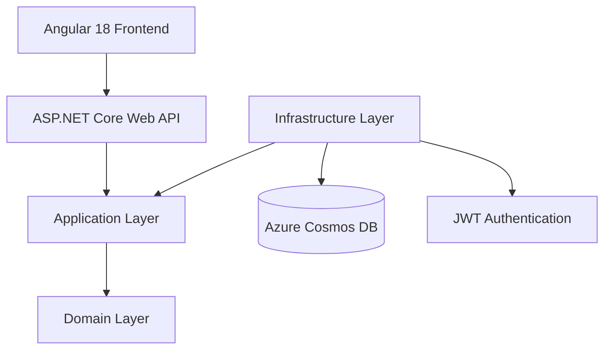

# Weekly Planner Application

An enterprise-grade full-stack platform for managing team backlogs, weekly sprint planning, and task execution tracking. Built with modern web technologies and optimized for high-scale performance on Microsoft Azure.

---

##Login Credentials : 

For Team Lead : 
Username : lead@test.com
Password : password123

For Team Members : 
1. Username : mayuresh@test.com
   Password : mayuresh123

2. Username : prajwal@test.com
   Password : prajwal123

3. Username : hitesh@test.com
   Password : hitesh123


## 🚀 Live Application Links

- **Frontend (Production)**: [https://calm-ground-05bf86c00.1.azurestaticapps.net](https://calm-ground-05bf86c00.1.azurestaticapps.net)
- **Backend API**: [https://weeklyplanner-api-mayuresh.azurewebsites.net](https://weeklyplanner-api-mayuresh.azurewebsites.net)
- **API Documentation (Swagger)**: [https://weeklyplanner-api-mayuresh.azurewebsites.net/swagger](https://weeklyplanner-api-mayuresh.azurewebsites.net/swagger/index.html)

---

## 🏗 System Architecture

The application follows the **Clean Architecture** (Onion) pattern, ensuring separation of concerns, testability, and independence from external frameworks.



### Architectural Layers:
- **Domain**: Core entities, enums, and business logic.
- **Application**: Application logic, DTOs, service interfaces, and mapping.
- **Infrastructure**: Data persistence (EF Core Cosmos), Authentication (JWT), and external integrations.
- **API**: Controllers, Middlewares, and standard API configuration.

---

## 🛠 Tech Stack

| Component | Technology |
| :--- | :--- |
| **Frontend** | Angular 18 (Standalone Components, Signals) |
| **Backend** | .NET 8 Web API |
| **Database** | Azure Cosmos DB (SQL API) |
| **ORM** | Entity Framework Core (Cosmos Provider) |
| **Security** | JWT Bearer Authentication / RBAC |
| **E2E Testing** | Playwright |
| **CI/CD** | GitHub Actions |
| **Hosting** | Azure App Service & Static Web Apps |

---

## 📂 Project Structure

```text
Weekly-Planner-App/
├── Backend/
│   ├── WeeklyPlanner.API/            # Entry point, Middleware, Controllers
│   ├── WeeklyPlanner.Application/    # Business Logic, Services, DTOs, Interfaces
│   ├── WeeklyPlanner.Domain/         # Entities, Enums, Value Objects
│   └── WeeklyPlanner.Infrastructure/ # Persistence (Cosmos), Auth (JWT Provider)
├── Frontend/
│   ├── src/app/
│   │   ├── core/                     # Guards, Interceptors, Base Services
│   │   ├── features/                 # Dashboard, Backlog, Team, Planning components
│   │   └── shared/                   # Common DTOs, Enums, UI Components
│   └── tests/                        # Playwright E2E Test Suite
└── README.md
```

---

## ✨ Core Features

- **JWT Authentication**: Secure login and registration with token-based sessions.
- **Role-Based Access Control (RBAC)**:
    - `TeamLead`: Manage backlog, create weekly plans, and freeze schedules.
    - `TeamMember`: View assignments and update task progress.
- **Product Backlog Management**: Centralized repository for all tasks with category tracking (Client, TechDebt, RnD).
- **Weekly Planning Board**: Automated capacity calculation (30h/member) and category allocation percentage checks.
- **Assignment & Progress Tracking**: Drag-and-drop workflow simulation for task lifecycles.
- **Analytics Dashboard**: Real-time visualization of category utilization and member productivity.

---

## 📡 API Endpoints (Core)

| Method | Endpoint | Description | Role Required |
| :--- | :--- | :--- | :--- |
| `POST` | `/api/auth/login` | Authenticate and get JWT | Public |
| `POST` | `/api/planning` | Create a new weekly plan | `TeamLead` |
| `GET` | `/api/planning/current` | Get active plan details | `All` |
| `POST` | `/api/assignment` | Assign task to member | `TeamLead` |
| `PATCH`| `/api/assignment/{id}/progress` | Update Task Completion % | `Assigned User` |
| `GET` | `/api/backlog` | List all backlog items | `All` |

---

## 💻 Local Development Setup

### Prerequisites:
- [.NET 8 SDK](https://dotnet.microsoft.com/en-us/download/dotnet/8.0)
- [Node.js v20+](https://nodejs.org/)
- [Angular CLI v18+](https://angular.dev/tools/cli)
- [Azure Cosmos DB Emulator](https://learn.microsoft.com/en-us/azure/cosmos-db/local-emulator) (or a Live Azure Connection)

### Backend:
```bash
cd Backend
dotnet restore
dotnet build
dotnet run --project WeeklyPlanner.API
```

### Frontend:
```bash
cd Frontend
npm install
ng serve
```

---

## 🌍 Environment Configuration

### Backend (`appsettings.json`)
```json
{
  "Cosmos": {
    "Endpoint": "YOUR_AZURE_ENDPOINT",
    "Key": "YOUR_AZURE_PRIMARY_KEY",
    "DatabaseName": "WeeklyPlanner"
  },
  "Jwt": {
    "Issuer": "WeeklyPlanner",
    "Audience": "WeeklyPlannerUsers",
    "Key": "YOUR_SUPER_SECRET_KEY"
  }
}
```

### Frontend (`environment.ts`)
```typescript
export const environment = {
  production: false,
  apiBaseUrl: 'http://localhost:5174/api'
};
```

---

## ☁️ Azure Deployment

This project is configured for automated deployment via **GitHub Actions**:

1. **Frontend**: Deploys to **Azure Static Web Apps**.
2. **Backend**: Deploys to **Azure App Service**.
3. **Configuration**: Use GitHub Secrets for `AZURE_STATIC_WEB_APPS_API_TOKEN` and Azure Portal Settings for DB connection strings.

---

## 🗄 Database Design

The system utilizes **NoSQL partitioning** to optimize for high read/write efficiency within specific planning windows.

| Container | Partition Key | Purpose |
| :--- | :--- | :--- |
| `Users` | `/id` | Cross-squad user lookups |
| `BacklogItems` | `/id` | Engineering backlog storage |
| `WeeklyPlans` | `/id` | Definition of the weekly sprint |
| `PlanAllocations` | `/weeklyPlanId` | Category boundaries for a specific plan |
| `Assignments` | `/weeklyPlanId` | Optimized for "Current Week" dashboard queries |

---

## 🧪 End-to-End Testing (Playwright)

Robust E2E tests are included to verify critical user journeys.

```bash
cd Frontend
npx playwright install
npx playwright test
```
Tests cover:
- Authentication flow.
- Team Lead plan creation.
- Team Member task progress updates.
- Dashboard metric accuracy.

---

## 🔒 Security Considerations

- **Middleware Pipeline**: Custom `ExceptionMiddleware` intercepts all errors to prevent sensitive data leakage.
- **Password Hashing**: BCrypt for secure credential storage.
- **CORS Management**: Restricted origins to specific production domains.
- **Input Validation**: Strict DTO binding using `[FromBody]` and business rule enforcement in the Application layer.

---

## 🔮 Future Improvements

- [ ] Real-time notifications via SignalR for team assignments.
- [ ] Multi-tenant support for multiple organizations.
- [ ] Export dashboard summaries to PDF/Excel.
- [ ] Dark mode support in UI.

---

## 👤 Author Information

**Mayuresh**
- Project Repository: [Mayuresh50/Weekly-Planner-App](https://github.com/Mayuresh50/Weekly-Planner-App)

---
*Developed for ThinkBridge (ThinkSchool) - March 2026*
